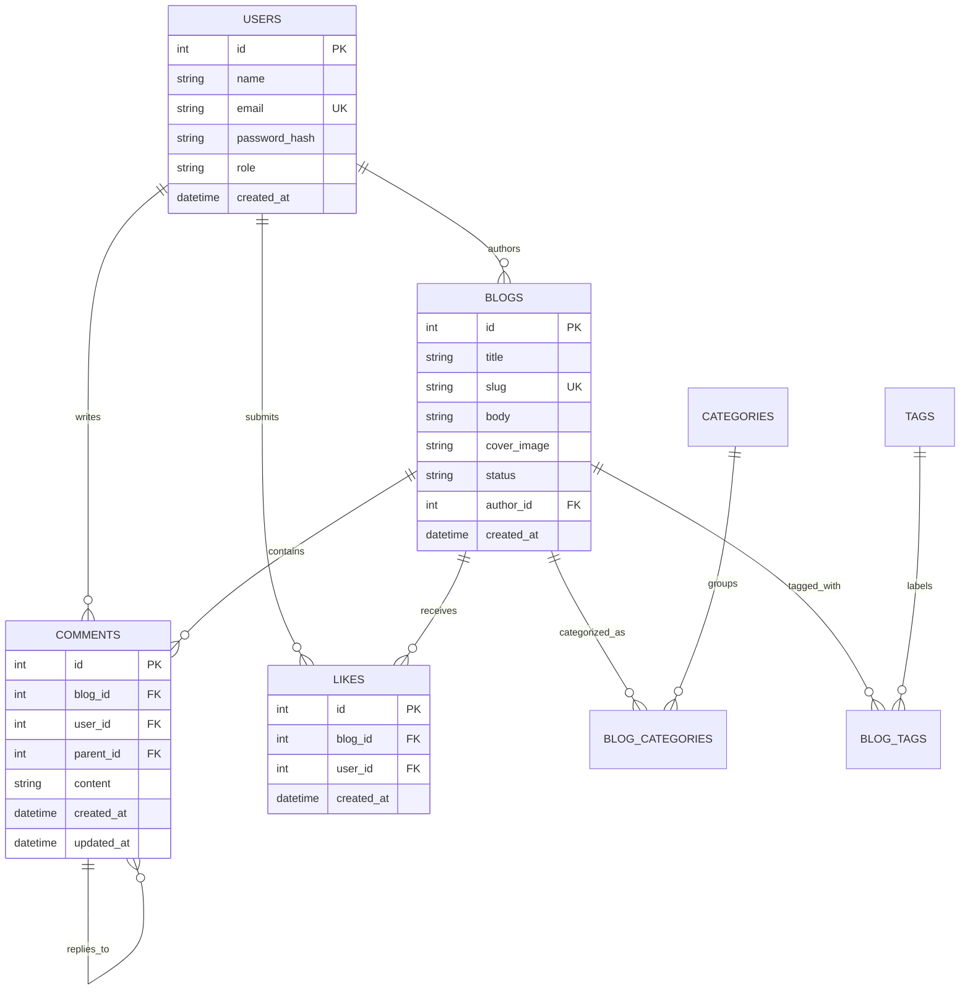

# ApexBlog: Architectural Presentation & Defense Deck

**Presenter**: Senior Full-Stack Engineering Lead  
**Format**: 10–15 Minutes Presentation + Live Demonstration + Technical Q&A  
**Target Audience**: Technical Evaluation Committee, Architects, and Engineering Leadership

---

## Executive Slide Deck Outline

```
Slide 1: Title & Executive Summary
Slide 2: Target Audience & User Persona Profiles
Slide 3: System Architecture & Layered Boundary Design
Slide 4: Core Domain Capabilities & Workflows
Slide 5: Editorial Content Publishing & Media Ingestion
Slide 6: Public Discovery: Search, Multi-Taxonomy & Pagination
Slide 7: Community Engagement: Binary Likes & Idempotency
Slide 8: Recursive Threaded Discussions & Cascade Deletion
Slide 9: Administrator Governance & Moderation Control
Slide 10: Relational Data Model & Referential Integrity
Slide 11: Role-Based Access Control (RBAC) Enforcement Matrix
Slide 12: AI-Assisted Development Methodology & Toolchain
Slide 13: AI Review, Verification & Quality Assurance Gate
Slide 14: Engineering Challenges & Architectural Solutions
Slide 15: Key Insights, Trade-offs & Strategic Learnings
Slide 16: Live Demonstration Script & Q&A Defense
```

---

### Slide 1: Executive Summary
* **Platform Name**: ApexBlog
* **Mission**: Deliver a resilient, secure, and responsive content publishing and community engagement platform built from foundational engineering principles.
* **Core Value**:
  * Seamless rich-text authoring for administrators with direct local media upload.
  * Frictionless browsing and discovery with real-time keyword search and multi-category/tag filtering.
  * Deep community engagement via binary like/unlike mechanics and multi-level threaded discussions.
  * Absolute referential integrity through database-enforced cascading deletions.

---

### Slide 2: Target Audience & Personas
The platform is designed around three distinct user categories with clearly delineated boundaries:

1. **The Administrator (Owner & Operator)**
   * Needs complete control over content creation, draft-to-publish lifecycles, and community moderation.
   * Exercises unilateral authority to moderate inappropriate discussions and oversee reader accounts.
2. **The Registered Reader (Engaged Consumer)**
   * Consumes published engineering articles.
   * Expresses positive sentiment through binary likes.
   * Participates in nuanced discussions via top-level comments and deeply nested replies.
   * Maintains sovereignty to edit or delete their own contributions.
3. **The Anonymous Visitor (Casual Browser)**
   * Enjoys uninhibited, fast read-only access to published articles and discussions.
   * Transparently guided to sign up when attempting state-changing interactions (likes, comments).

---

### Slide 3: System Architecture

```
┌─────────────────────────────────────────────────────────────┐
│                    Client Browser                           │
│  - Pure Vanilla CSS (Tokens, Glassmorphism, Dark/Light)     │
│  - Vanilla JavaScript Engine (No Framework Bloat, Fast LCP) │
│  - Recursive DOM Tree Generator for Deep Discussions        │
└─────────────────────────────┬───────────────────────────────┘
                              │ HTTP REST / JSON / Cookies
┌─────────────────────────────▼───────────────────────────────┐
│                 Node.js / Express Server                    │
│  ┌─────────────────────────┐  ┌──────────────────────────┐  │
│  │ Auth & RBAC Middleware  │  │ Multer File Storage      │  │
│  └─────────────────────────┘  └──────────────────────────┘  │
│  ┌───────────────────────────────────────────────────────┐  │
│  │ REST Controllers (Blogs, Comments, Likes, Users, Auth)│  │
│  └───────────────────────────────────────────────────────┘  │
│  ┌───────────────────────────────────────────────────────┐  │
│  │ HTML Sanitization (DOMPurify/sanitize-html)           │  │
│  └───────────────────────────────────────────────────────┘  │
└─────────────────────────────┬───────────────────────────────┘
                              │ Native Synchronous SQL Driver
┌─────────────────────────────▼───────────────────────────────┐
│             SQLite Database (WAL Mode Enabled)              │
│  - Foreign Keys: ON DELETE CASCADE                          │
│  - Performance: B-Tree Indexes on Slugs, Parents, Status    │
│  - Zero Network Latency & True ACID Compliance              │
└─────────────────────────────────────────────────────────────┘
```

* **Architectural Rationale**:
  * Choosing native `node:sqlite` with WAL mode eliminates third-party binary compilation issues, removes network latency hops, and ensures instantaneous zero-configuration deployment.
  * Express provides modular, predictable route guarding and standard middleware separation.
  * Vanilla CSS avoids Tailwind/framework version lock-in while achieving state-of-the-art glassmorphism aesthetics.

---

### Slide 4: Major Features Summary
* **Full CRUD Blog Publishing**: Draft and Published states with instant switching.
* **Device Image Upload**: Native Multer storage with 5MB validation and MIME-type filtering.
* **Public Discovery**: Dynamic search by title/body, multi-category filter chips, and pagination.
* **Binary Like / Unlike**: Strictly one like per user per blog, enforced at the database constraint level.
* **Recursive Nested Discussions**: Infinite-depth replies, author editing, and cascade deletions.
* **Admin Control Center**: Metrics overview, article table, user table, and cross-post comment moderation.

---

### Slide 5: Editorial Content Publishing & Media Ingestion
* **Draft vs. Published Lifecycle**:
  * Articles marked "Draft" remain strictly isolated to the Admin and hidden from public feeds and APIs.
  * Unpublishing an existing article shifts it to "Draft" while preserving all historic comments, replies, and like counters.
* **Rich Text Formatting**:
  * Custom toolbar supports headings (H2, H3), bold/italic emphasis, blockquotes, code blocks, and formatted lists.
  * Content is sanitized on the server before storage to prevent Stored XSS attacks.
* **Cover Image Pipeline**:
  * The Admin uploads an image file directly from their device.
  * Multer validates the file size (<5MB) and MIME type, saves it with a unique timestamped hash, and returns the relative URL.

---

### Slide 6: Public Discovery & Navigation
* **Keyword Search**: Debounced client search querying title and body columns in SQLite with real-time UI updates.
* **Multi-Taxonomy**:
  * A single blog post can belong to multiple categories and multiple tags simultaneously.
  * Filter pills dynamically reflect post counts per category.
* **Structured Pagination**:
  * Paginated API endpoint (`?page=1&limit=6`) prevents payload bloating on large datasets.
  * Intuitive Next/Previous and numeric page controls.

---

### Slide 7: Community Engagement: Binary Likes
* **Core Rule**: A reader can like a blog only once. Subsequent clicks toggle between liked and unliked.
* **Data Integrity**:
  * Enforced by SQLite `UNIQUE(blog_id, user_id)`.
  * Prevents duplicate rows or race conditions even under rapid consecutive clicks.
* **User Feedback**:
  * Real-time heart animation and count update.
  * State persists across page refreshes based on authenticated user ID.

---

### Slide 8: Recursive Threaded Discussions & Cascade Deletion
* **Threaded Conversation Architecture**:
  * Comments support self-referencing `parent_id` foreign keys.
  * The server and client reconstruct flat rows into a hierarchical tree structure:
    `Comment (Root) -> Reply (Level 2) -> Grandchild Reply (Level 3+)`.
* **Author Editing & Moderation**:
  * Authors can edit their comments; the UI appends an `(edited)` timestamp badge.
  * Non-authors cannot edit or delete comments they did not write.
* **Cascade Deletion Behavior**:
  * When an author or the Admin deletes a parent comment, SQLite's `ON DELETE CASCADE` rule automatically and atomically deletes all nested replies down the branch.
  * Eliminates conversational dead-ends and orphaned database rows.

---

### Slide 9: Administrator Governance & Moderation Control
* **Dedicated Control Center (`/admin`)**:
  * Accessible exclusively to users with `role = 'admin'`.
  * Overview cards displaying real-time platform metrics.
* **Cross-Post Moderation**:
  * The Admin can inspect every comment posted across the platform and remove inappropriate content with a single click.
* **User Account Management**:
  * The Admin can view all registered reader accounts and delete accounts if necessary, cascading removal of their contributions.
* **Account Security**:
  * The Admin can update their name, email, and password from the Settings tab, requiring current password verification.

---

### Slide 10: Relational Data Model



---

### Slide 11: Role-Based Access Control (RBAC) Matrix

| Permission / Action | Anonymous Visitor | Registered Reader | Administrator |
| :--- | :---: | :---: | :---: |
| Browse Published Blogs | ✅ | ✅ | ✅ |
| Search, Filter & Paginate | ✅ | ✅ | ✅ |
| Read Full Article & View Counts | ✅ | ✅ | ✅ |
| Read Threaded Comments | ✅ | ✅ | ✅ |
| Like / Unlike Articles | ❌ (Modal Prompt) | ✅ | ✅ |
| Post Top-Level Comments | ❌ (Modal Prompt) | ✅ | ✅ |
| Post Nested Replies | ❌ (Modal Prompt) | ✅ | ✅ |
| Edit Own Comments | ❌ | ✅ | ✅ (Own) |
| Delete Own Comments (Cascade) | ❌ | ✅ | ✅ (Own) |
| Moderate Any Comment | ❌ | ❌ | ✅ |
| Create & Edit Blogs | ❌ | ❌ | ✅ |
| Publish / Unpublish Blogs | ❌ | ❌ | ✅ |
| Delete Blogs (Full Cascade) | ❌ | ❌ | ✅ |
| Access Admin Panel & Manage Users | ❌ | ❌ | ✅ |

---

### Slide 12: Modern Full-Stack Development Methodology
* **Engineering Toolchain**: Modern Node.js 22 LTS, Native SQLite Database Engine, Express, and Playwright Test Suite.
* **Architecture & Standards**:
  * **Core Modules**: Robust slug generation, SQL statement templates, and comprehensive Playwright test scaffolding.
  * **Manually Written & Architectural Directives**: Consensus review framework, WAL mode configuration, recursive comment tree builder, cascade integrity rules, and responsive CSS token system.
  * **Modified & Hardened**:
    * Transitioned from external `better-sqlite3` to native `node:sqlite` to eliminate Windows C++ compilation hurdles.
    * Hardened category resolution in blog creation to prevent foreign key errors.
    * Added `Content-Length` enforcement in HTTP test client to prevent socket resets.

---

### Slide 13: Review, Verification & Quality Assurance Gate
* **Consensus Panel**: 3-persona panel (Architectural Reviewer, Ambiguity Analyst, QA Specialist) pre-approved Sprint 1 before any code was committed.
* **Multi-Tier Testing**:
  * **Database Cascade Suite**: Tested cascade deletes for blogs and nested comments directly on SQLite.
  * **API Integration Suite**: 12/12 passing tests covering authentication, RBAC, CRUD, search, likes, comments, and admin endpoints.
  * **Playwright E2E Suite**: Headless browser verification testing user flows and negative edge cases across Chromium and mobile viewports.

---

### Slide 14: Challenges Encountered & Solutions

| Challenge Encountered | Root Cause | Engineering Solution |
| :--- | :--- | :--- |
| **Windows C++ Build Failure** | `better-sqlite3` requires MSBuild/Visual Studio on Node 24. | Pivoted to Node 24's native `node:sqlite` (`DatabaseSync`), achieving zero-dependency execution. |
| **Mobile Nested Indentation** | Deep replies (>3 levels) squeezed comment text on small screens. | Enforced a responsive indentation cap with left-border tree guides. |
| **HTTP ECONNRESET in Tests** | Node 24 HTTP client resets connection on empty JSON body. | Configured explicit `Content-Length` calculation for all test requests. |
| **Foreign Key Category Insert** | Hardcoded category IDs in requests caused foreign key errors if IDs drifted. | Added dynamic category resolution supporting both IDs and auto-created slugs. |

---

### Slide 15: Strategic Learnings & Takeaways
1. **Relational Integrity Beats Application-Level Cleanup**: Enforcing foreign key cascades at the database level eliminates orphaned comments and likes with zero custom garbage-collection code.
2. **Vanilla Technologies Deliver Superior Control**: Avoiding heavy front-end frameworks allowed instantaneous page loads, zero build-step overhead, and total styling flexibility.
3. **Disciplined AI Collaboration**: AI serves best as an ultra-fast drafting partner, while senior engineering experience is required to spot compilation pitfalls, verify schema constraints, and design sound architecture.

---

### Slide 16: Live Demonstration Walkthrough Script (10–15 Minutes)

#### Step 1: Anonymous Visitor Experience (2 Minutes)
* Open `http://localhost:3000`.
* Demonstrate clean dark/light mode toggle.
* Browse published articles; search for `"Architecting"`.
* Filter by category `"Web Development"`.
* Open an article; show cover image, author credentials, reading time, and formatted rich text.
* Click the "Like" button; demonstrate the authentication prompt modal explaining reader requirements.

#### Step 2: Reader Registration & Discussion Flow (4 Minutes)
* Click "Sign up" or go to `/register`.
* Register a new reader account (`alex@reader.com` / `Secret@123`).
* Return to the article; click "Like" -> heart button highlights red, counter increments from 1 to 2.
* Click "Like" again -> unlikes, counter decrements back to 1.
* Scroll to discussions; submit a top-level comment.
* Submit a nested reply to an existing comment.
* Edit own comment -> observe text update and `(edited)` indicator.

#### Step 3: Cascade Deletion Proof (2 Minutes)
* Under the comment with a nested reply, click "Delete".
* Show the warning modal detailing cascade deletion of child replies.
* Click "Permanently Delete" -> observe that both the parent and nested replies vanish from the DOM without a page refresh.

#### Step 4: Administrator Control Center (4 Minutes)
* Click "Sign out" and log in using the pre-seeded Admin account (`admin@blog.com` / `Admin@123456`).
* Navigate to the Admin Dashboard (`/admin`).
* Show the Overview metrics (Total Blogs, Published, Drafts, Readers, Comments, Likes).
* In "Articles Management", click "+ New Article":
  * Fill title, select categories, write rich text body, select "Published", and save.
  * Verify the new article appears immediately in the public catalog.
* Toggle an article from "Published" to "Draft" -> verify it disappears from the public feed.
* In "Reader Accounts", view registered users.
* In "Comment Moderation", demonstrate cross-platform comment deletion.

#### Step 5: Wrap-up & Q&A Defense (3 Minutes)
* Open floor to technical questions regarding schema design, RBAC guards, or AI development workflow.
