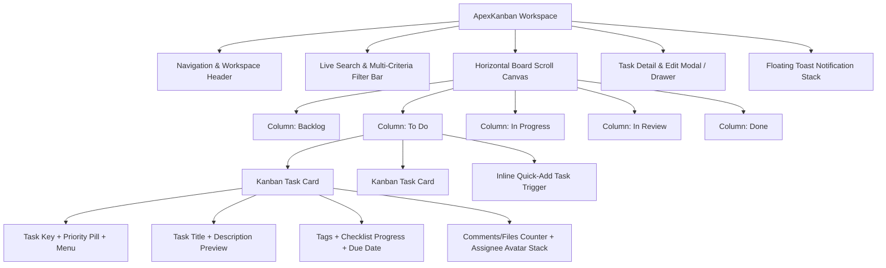

# Kanban Design System Specification (ApexKanban DS)

**Application Type**: Simple & High-Performance Kanban Task Board  
**Target Runtimes**: Desktop, Tablet, and Mobile Web Browsers  
**Design Philosophy**: Tactile Physicality, Low Cognitive Friction, Semantic Clarity, and Dark/Light Mode Duality  
**Version**: 1.0.0  
**Specification Author**: Senior Full-Stack Architect & Principal UI/UX Systems Designer (25 YOE)

---

## 1. Executive Design Philosophy & Guiding Principles

The **ApexKanban Design System** is engineered to transform task orchestration from a static list of chores into an intuitive, tactile, and highly responsive experience. It synthesizes modern ergonomic design principles:

1. **Spatial Hierarchy & Information Density**:
   - Critical data (task key, title, priority, due date alert, assignee) must be readable in **under 200 milliseconds** during rapid visual scanning.
   - Secondary metadata (checklists, comments count, attachments count, detailed tags) progressively discloses without visual clutter.
2. **Tactile Physicality & Motion Physics**:
   - Drag-and-drop interactions simulate real-world card physics: when grabbed, cards lift (`translateY(-4px)`), scale slightly (`scale(1.02)`), rotate by a natural angle (`rotate(1.5deg)`), and cast a deep diffused shadow (`shadow-card-drag`).
   - Drop targets reveal animated insertion guides with an ethereal accent glow, providing unmistakable drop cues.
3. **Ergonomic Color Harmony**:
   - Zero harsh default primaries. Every shade is tuned in HSL color space with carefully calibrated luminance and chroma curves to prevent eye strain during long working sessions.
   - Seamless **Dark Theme** (deep slate obsidian with luminous accents) and **Light Theme** (crisp alabaster porcelain with high-contrast text and warm borders).
4. **Inclusive Accessibility (WCAG 2.2 AAA/AA)**:
   - High text contrast ratios ($\ge 7:1$ for body, $\ge 4.5:1$ for captions).
   - Color is never the sole communicator of state (e.g. priority labels pair distinct icons + text tags + color tints).
   - Full keyboard navigation model (Space to pickup card, Arrow keys to traverse columns and positions, Enter to drop, Esc to cancel).

---

## 2. Comprehensive Design Tokens

### 2.1 Color Palette & Semantic System

All colors are declared via CSS Custom Properties on `:root` and overridden in `[data-theme="dark"]`.

#### Color Swatches & Tokens Table

| Token Name | Light Theme Value | Dark Theme Value | Usage Description |
| :--- | :--- | :--- | :--- |
| `--bg-canvas` | `#f8fafc` (Slate 50) | `#0a0f1d` (Deep Obsidian) | Root application canvas |
| `--bg-surface-1` | `#ffffff` (Pure White) | `#111827` (Charcoal Slate) | Topbar, sidebar, column tracks |
| `--bg-surface-2` | `#f1f5f9` (Slate 100) | `#1e293b` (Elevated Slate) | Column body background, input fields |
| `--bg-surface-card` | `#ffffff` | `#1a2234` | Task card background |
| `--bg-surface-hover`| `#f8fafc` | `#243046` | Interactive hover states |
| `--bg-glass` | `rgba(255,255,255,0.75)` | `rgba(17,24,39,0.75)` | Floating toolbars with backdrop blur |
| `--text-primary` | `#0f172a` (Slate 900) | `#f8fafc` (Slate 50) | Headlines, card titles, primary copy |
| `--text-secondary`| `#475569` (Slate 600) | `#94a3b8` (Slate 400) | Subtitles, column counts, timestamps |
| `--text-muted` | `#94a3b8` (Slate 400) | `#64748b` (Slate 500) | Placeholders, card IDs, disabled text |
| `--border-subtle` | `#e2e8f0` (Slate 200) | `#1e293b` (Slate 800) | Card borders, column dividers |
| `--border-default`| `#cbd5e1` (Slate 300) | `#334155` (Slate 700) | Input field borders, active states |
| `--border-strong` | `#94a3b8` (Slate 400) | `#475569` (Slate 600) | Active card drag border, focus rings |
| `--brand-primary` | `#4f46e5` (Indigo 600) | `#6366f1` (Indigo 500) | Primary actions, focused tab pills |
| `--brand-gradient`| `linear-gradient(135deg, #4f46e5 0%, #7c3aed 100%)` | `linear-gradient(135deg, #6366f1 0%, #8b5cf6 100%)` | Primary button, brand icon glow |
| `--brand-glow` | `rgba(99, 102, 241, 0.25)` | `rgba(99, 102, 241, 0.4)` | Focus halos, drag placeholder glow |

#### Priority Semantic Colors
| Priority Level | Icon Symbol | Background Tint (Light) | Text/Icon Color (Light) | Background Tint (Dark) | Text/Icon Color (Dark) |
| :--- | :---: | :--- | :--- | :--- | :--- |
| **P0: Urgent / Critical** | 🔥 | `#fef2f2` (Rose 50) | `#e11d48` (Rose 600) | `rgba(225,29,72,0.15)` | `#fb7185` (Rose 400) |
| **P1: High Priority** | ⚡ | `#fff7ed` (Orange 50)| `#ea580c` (Orange 600)| `rgba(234,88,12,0.15)` | `#fb923c` (Orange 400)|
| **P2: Medium Priority** | 🔷 | `#eff6ff` (Blue 50) | `#2563eb` (Blue 600) | `rgba(37,99,235,0.15)` | `#60a5fa` (Blue 400) |
| **P3: Low Priority** | 🟢 | `#f0fdf4` (Green 50)| `#16a34a` (Green 600)| `rgba(22,163,74,0.15)` | `#4ade80` (Green 400) |

#### Column Status Identity Accents
| Column Key | Status Title | Accent Dot / Bar Color | Background Wash (Drag Over) |
| :--- | :--- | :--- | :--- |
| `backlog` | Backlog | `#8b5cf6` (Purple 500) | `rgba(139, 92, 246, 0.06)` |
| `todo` | Ready to Do | `#0ea5e9` (Sky 500) | `rgba(14, 165, 233, 0.06)` |
| `in-progress`| In Progress | `#f59e0b` (Amber 500) | `rgba(245, 158, 11, 0.06)` |
| `in-review` | Code Review | `#6366f1` (Indigo 500) | `rgba(99, 102, 241, 0.06)` |
| `done` | Done / Shipped | `#10b981` (Emerald 500) | `rgba(16, 185, 129, 0.06)` |

---

### 2.2 Typography Scale & Font Architecture

* **Display & Header Font**: `'Outfit', -apple-system, BlinkMacSystemFont, sans-serif`  
  *Characteristics*: Geometric, open letter apertures, modern architectural feel.
* **Body & UI Font**: `'Inter', -apple-system, BlinkMacSystemFont, 'Segoe UI', Roboto, sans-serif`  
  *Characteristics*: Exceptionally readable at micro-sizes, optimized x-height, clear numeric distinctions.
* **Monospace & Code Font**: `'JetBrains Mono', 'Fira Code', monospace`  
  *Characteristics*: Tabular numbers for task keys (`KB-104`), story points, and commit hashes.

#### Typographic Scale Table

| Token | Font Size | Line Height | Weight | Letter Spacing | Target Element |
| :--- | :---: | :---: | :---: | :---: | :--- |
| `--font-3xl` | `28px (1.75rem)` | `34px` | 700 (Bold) | `-0.025em` | Board Title, Modal Hero Headlines |
| `--font-2xl` | `22px (1.375rem)`| `28px` | 600 (SemiBold)| `-0.02em` | Section Titles, Column Group Names |
| `--font-xl` | `18px (1.125rem)`| `24px` | 600 (SemiBold)| `-0.015em` | Modal Subheadings, Toast Titles |
| `--font-lg` | `16px (1.0rem)` | `22px` | 600 (SemiBold)| `-0.01em` | Column Headers, Primary Button Text |
| `--font-base` | `14px (0.875rem)`| `20px` | 500 (Medium) | `0em` | Card Titles, Input Text, Dropdowns |
| `--font-sm` | `12px (0.75rem)` | `16px` | 500 (Medium) | `+0.01em` | Metadata, Tags, User Names, Timestamps|
| `--font-xs` | `11px (0.6875rem)`|`14px` | 600 (SemiBold)| `+0.025em` | Task Key, Priority Pill, WIP Limit Tag |

---

### 2.3 Spacing, Grid & Layout Metrics

The system enforces an uncompromising **4px base unit metric**:

```
 4px   8px   12px   16px   20px   24px   32px   40px   48px   64px
 [·]   [··]  [···]  [····] [····] [····] [····] [····] [····] [····]
  xs    sm    md     base   lg     xl     2xl    3xl    4xl    5xl
```

| Spacing Token | Pixel Value | Typical Application |
| :--- | :---: | :--- |
| `--space-1` | `4px` | Inner badge padding, icon-to-text gap, avatar border |
| `--space-2` | `8px` | Button horizontal padding, card internal gap, tag spacing |
| `--space-3` | `12px` | Input field vertical padding, card stack gap |
| `--space-4` | `16px` | Column internal padding, card body padding, dialog gutter |
| `--space-5` | `20px` | Header padding, column horizontal gap |
| `--space-6` | `24px` | Modal body padding, board edge margins |
| `--space-8` | `32px` | Board canvas header separation |
| `--space-12`| `48px` | Empty state container vertical padding |

#### Board Layout Standards
* **Column Width**: Minimum `280px`, Nominal `320px`, Maximum `360px`.
* **Column Gap**: `16px` (Mobile/Tablet), `20px` (Desktop).
* **Card Gap in Column**: `12px` between stacked cards.
* **WIP Limit Height**: Columns maintain a minimum height of `480px` or viewport height minus topbars.

---

### 2.4 Elevation, Shadows & Glassmorphism

```
[Layer 0: Canvas] -> [Layer 1: Column Track] -> [Layer 2: Card] -> [Layer 3: Hovered Card] -> [Layer 4: Dragging Card] -> [Layer 5: Modal/Toast]
```

| Token | Light Value | Dark Value | Purpose |
| :--- | :--- | :--- | :--- |
| `--shadow-sm` | `0 1px 2px rgba(0,0,0,0.05)` | `0 1px 2px rgba(0,0,0,0.4)` | Sub-header, filter pills |
| `--shadow-md` | `0 4px 6px -1px rgba(0,0,0,0.07), 0 2px 4px -1px rgba(0,0,0,0.04)` | `0 4px 6px -1px rgba(0,0,0,0.5), 0 2px 4px -1px rgba(0,0,0,0.3)` | Rest state task card |
| `--shadow-card-hover` | `0 10px 15px -3px rgba(0,0,0,0.08), 0 4px 6px -2px rgba(0,0,0,0.04)` | `0 10px 15px -3px rgba(0,0,0,0.6), 0 4px 6px -2px rgba(0,0,0,0.4)` | Card hover elevation |
| `--shadow-card-drag` | `0 20px 25px -5px rgba(15,23,42,0.2), 0 10px 10px -5px rgba(15,23,42,0.1), 0 0 0 2px var(--brand-primary)` | `0 20px 25px -5px rgba(0,0,0,0.8), 0 10px 10px -5px rgba(0,0,0,0.5), 0 0 15px var(--brand-glow)` | Card actively being dragged |
| `--shadow-modal` | `0 25px 50px -12px rgba(0,0,0,0.25)` | `0 25px 50px -12px rgba(0,0,0,0.85)` | Dialogs and drawers |
| `--glass-backdrop`| `backdrop-filter: blur(12px) saturate(180%)` | `backdrop-filter: blur(16px) saturate(200%)` | Translucent topbars & modals |

---

### 2.5 Border Radii Tokens

| Radius Token | Value | Applied To |
| :--- | :---: | :--- |
| `--radius-sm` | `4px` | Tiny priority pills, progress bar tracks, key tags |
| `--radius-md` | `8px` | Buttons, input fields, dropdown menus, filter chips |
| `--radius-lg` | `12px` | Task cards, quick-add inline input boxes |
| `--radius-xl` | `16px` | Columns, modals, slide-out drawer panels |
| `--radius-full`| `9999px`| User avatars, status indicator dots, circular icon buttons |

---

### 2.6 Transitions & Animation Physics

| Motion Token | Timing Curve | Duration | Purpose |
| :--- | :--- | :---: | :--- |
| `--motion-fast` | `cubic-bezier(0.16, 1, 0.3, 1)` | `120ms` | Button clicks, checkbox toggles, hover color shifts |
| `--motion-base` | `cubic-bezier(0.16, 1, 0.3, 1)` | `200ms` | Card hover lift, modal fade, accordion expand |
| `--motion-spring`| `cubic-bezier(0.34, 1.56, 0.64, 1)`| `300ms` | Card grab pickup, badge bounce, drop placeholder snap |
| `--motion-drag` | `ease-out` | `0ms` (instant) | Real-time pointer tracking during drag |

---

## 3. UI Component Architecture & Visual Layouts



---

### 3.1 Board Navigation & Workspace Topbar

The persistent top navigation establishes the workspace context, project switcher, search, member presence, and primary calls-to-action.

```
+-------------------------------------------------------------------------------------------------------------+
| [Logo] ApexKanban   |  📁 Sprint 34 - Core Engine v2.0 [v]  |  (32 Tasks · 14 Done)                         |
|                                                                                                             |
| [🔍 Search tasks (Cmd+K)...]  [Filter by Tag [v]]  [Priority [v]]   [👤 Team Stack (4)]  [+ New Task] [🌙]  |
+-------------------------------------------------------------------------------------------------------------+
```

#### Detailed Specs:
* **Height**: `64px`.
* **Surface**: `--bg-surface-1` with bottom border `--border-subtle` and subtle glassmorphism (`backdrop-filter: blur(12px)`).
* **Workspace Selector**: Shows active project/sprint with chevron icon and status pill (`Active Sprint`).
* **Search Input**:
  * Width: `240px` (expands to `320px` on focus).
  * Leading icon: Search magnifying glass (`16x16`).
  * Keyboard hint badge: `<kbd>⌘K</kbd>` or `<kbd>Ctrl+K</kbd>`.
* **Member Stack**: Overlapping 28px circular avatars (`margin-left: -8px`), 2px border matching canvas, with a `+3` overflow pill triggering member filter list.
* **New Task Button**:
  * Gradient background: `--brand-gradient`.
  * Text: `+ Create Task`.
  * Icon: Plus symbol (`16x16`).
  * Elevation: `--shadow-sm` with active press scale (`0.98`).

---

### 3.2 Filter & Metrics Sub-Header Bar

Provides real-time, non-destructive filtering across columns with zero latency.

```
+-------------------------------------------------------------------------------------------------------------+
| Filters:  [All Tasks]  [My Tasks (5)]  [🔥 Urgent Only]  [🎨 Design]  [⚙️ Backend]  |  Clear All  | View: ⊞ ≡ |
+-------------------------------------------------------------------------------------------------------------+
```

#### Detailed Specs:
* **Height**: `48px`.
* **Filter Pills**:
  * Default: `--bg-surface-2`, `--text-secondary`, `radius-full`, padding `4px 12px`.
  * Active: `--brand-primary`, white text, with checkmark icon.
* **WIP Analytics Counter**: Displays real-time ratio of tasks in flight vs maximum recommended threshold.

---

### 3.3 Kanban Column Component (`.kanban-column`)

The structural column represents a specific workflow state and acts as a droppable container.

```
+----------------------------------------------------+
|  🔵 In Progress                    [ 3 / 5 ]  [···] |  <-- Column Header
+----------------------------------------------------+
|                                                    |
|  +----------------------------------------------+  |
|  | [KB-104]  [⚡ High]                     [···]|  |  <-- Task Card 1
|  | Refactor Database Cascade Trigger Engine     |  |
|  | [Backend] [SQLite]                           |  |
|  | ☑ 3/4   📅 Oct 14                 [Avatar]   |  |
|  +----------------------------------------------+  |
|                                                    |
|  +----------------------------------------------+  |
|  | [KB-108]  [🔷 Medium]                   [···]|  |  <-- Task Card 2
|  | Build Drag Physics Micro-Animations          |  |
|  | [Frontend] [CSS]                             |  |
|  | ☑ 0/2   💬 4                      [Avatar]   |  |
|  +----------------------------------------------+  |
|                                                    |
|  - - - - - - - - - - - - - - - - - - - - - - - -   |  <-- Insertion Drop Indicator
|                                                    |
|  [+ Add a task...]                                 |  <-- Quick Add Action
+----------------------------------------------------+
```

#### Detailed Specs:
* **Width**: `320px` fixed, with `flex-shrink: 0`.
* **Border Radius**: `--radius-xl` (`16px`).
* **Background**: `--bg-surface-2` (light slate tint in light mode, deep carbon in dark mode).
* **Border**: `1px solid var(--border-subtle)`.
* **Header Layout**:
  * Status indicator dot (`8px` circle with column accent color).
  * Column Title: `--font-lg` (`16px`), weight 600.
  * Task Count / WIP Badge: `padding: 2px 8px`, `radius-full`, monospace numbers (`[ 3 / 5 ]`).
    * *Normal State*: Slate badge (`--bg-surface-1`).
    * *WIP Exceeded State*: Soft red badge (`#fee2e2` / text `#dc2626`) with alert pulse icon.
  * Actions Menu Button: Three vertical dots (`···`), ghost style, reveals column settings (Rename, Set WIP Limit, Clear Completed, Delete Column).
* **Column Body**:
  * Vertical flex stack with `12px` gap.
  * Overflow-y: `auto` with custom sleek `6px` scrollbar.
  * Padding: `12px` all around.
* **Quick-Add Trigger**:
  * Default state: Subtle text button `+ Add a task` with hover highlight.
  * Expanded inline input state: Card-like white box with textarea, `[Add Task]` primary button and `[Cancel]` icon.

---

### 3.4 Kanban Task Card Component (`.kanban-card`)

The foundational unit of user interaction. Designed for density, hierarchy, and tactile feedback.

#### Card Anatomy Breakdown:
```
+----------------------------------------------------------------+
|  [KB-102]                  [🔥 Urgent]                   [⋮⋮]  |  <-- Top Row: Key, Priority, Drag Handle
+----------------------------------------------------------------+
|  Implement JWT Token Revocation & Blacklist                    |  <-- Title Row (14px, Weight 600, Max 2 lines)
|  Ensure compromised tokens are purged immediately...           |  <-- Description Snippet (12px, Muted, 1 line)
+----------------------------------------------------------------+
|  [Security]  [API]                                             |  <-- Taxonomy Chips Row
+----------------------------------------------------------------+
|  ☑ 4/5      📅 Tomorrow (Overdue)      💬 3   📎 1     [Avatar]|  <-- Footer Meta Row
+----------------------------------------------------------------+
```

#### Detailed Element Specifications:
1. **Card Container**:
   * Background: `--bg-surface-card`.
   * Border: `1px solid var(--border-subtle)`.
   * Radius: `--radius-lg` (`12px`).
   * Padding: `14px 16px`.
   * Shadow: `--shadow-md`.
   * Transition: `transform 180ms ease, box-shadow 180ms ease, border-color 180ms ease`.
2. **Top Row**:
   * **Task Key**: Monospace badge (`KB-102`), font size `11px`, bold, `--text-muted`, clickable to copy key or open drawer.
   * **Priority Pill**:
     * Padding: `2px 8px`, border-radius: `6px`.
     * Icon (`12x12`) + uppercase text (`10px`).
     * `Critical` = Crimson gradient / red badge; `High` = Orange badge; `Medium` = Blue badge; `Low` = Slate badge.
   * **Drag Grip / Context Menu**: Subtle 6-dot icon visible on hover or persistent for screen readers.
3. **Title & Body**:
   * **Title**: Font size `14px`, line-height `20px`, weight 600, `--text-primary`. Hover color shifts to `--brand-primary`.
   * **Description Teaser**: Font size `12px`, line-height `16px`, `--text-muted`, CSS `-webkit-line-clamp: 2` ellipsis.
4. **Tag & Category Chips**:
   * Height: `20px`, padding: `0 8px`, border-radius: `--radius-sm` (`4px`).
   * Font size: `11px`, weight 500.
   * Background: Subtle pastel tint matching category archetype.
5. **Footer Row (Indicators & Assignee)**:
   * **Subtask Checklist Progress**:
     * Checklist icon (`14x14`).
     * Text: `3/5`.
     * Mini progress bar (`36px` wide, `4px` high, background `--border-subtle`, fill `--brand-primary`). Turns green when `5/5`.
   * **Due Date Badge**:
     * Calendar icon (`12x12`) + date string (`Oct 18` or `Tomorrow`).
     * States:
       * *Normal*: `--text-secondary`.
       * *Due Today / Tomorrow*: Amber tint (`#fef3c7`, text `#d97706`).
       * *Overdue*: Ruby red tint (`#fee2e2`, text `#dc2626`, bold alert).
   * **Attachments & Comments**:
     * Icons (`💬` / `📎`) with count badge (`12px`, `--text-muted`).
   * **Assignee Avatar**:
     * Size: `26x26` circle.
     * High-res image or 2-letter initials with curated color generation.
     * Tooltip displays user's full name and email.

---

### 3.5 Drag & Drop Visual States & Feedback

| Drag State | Visual Transformation & CSS Styling | Audio / Micro-Feedback |
| :--- | :--- | :--- |
| **Hover** | `transform: translateY(-2px); box-shadow: var(--shadow-card-hover); border-color: var(--border-default);` | Cursor: `grab` |
| **Grabbed / Dragging** | `cursor: grabbing; transform: scale(1.03) rotate(2deg); box-shadow: var(--shadow-card-drag); z-index: 1000; opacity: 0.95;` | Slight haptic lift, cursor locks |
| **Original Slot (Ghost)** | Card in original column turns into a ghost placeholder: `border: 2px dashed var(--brand-primary); background: var(--bg-glass); opacity: 0.35;` | Retains exact card dimensions |
| **Insertion Target (Drop Line)**| Dynamic `3px` glowing bar appears between neighboring cards: `height: 3px; background: var(--brand-primary); box-shadow: 0 0 10px var(--brand-glow); border-radius: 2px;` | Animates expanding vertically by 8px |
| **Column Drag-Over Highlight**| Droppable column track receives border highlight and background wash: `border-color: var(--brand-primary); background: var(--column-accent-wash);` | Column header task count previews update (`+1`) |

---

### 3.6 Task Detail & Edit Drawer / Modal

Clicking any card opens the detailed inspection and editing interface.

```
+-------------------------------------------------------------------------------------------------+
| [KB-102]  In Progress [v]    [🔥 Urgent [v]]                             [Share] [Archive] [✕] |
|-------------------------------------------------------------------------------------------------|
|                                                                 |                               |
|  Title:                                                         |  METADATA                     |
|  [ Implement JWT Token Revocation Engine                     ]  |                               |
|                                                                 |  Assignee:                    |
|  Description:                                                   |  [ (👤) Sarah Connor [v] ]    |
|  +-----------------------------------------------------------+  |                               |
|  | [B] [I] [List] [Code] [Link]                              |  |  Due Date:                    |
|  | We must ensure that logging out immediately blacklists    |  |  [ 📅 2026-10-18 [v]     ]    |
|  | the JWT token in SQLite using a time-to-live table.       |  |                               |
|  +-----------------------------------------------------------+  |  Tags:                        |
|                                                                 |  [+ Add Tag]                  |
|  Checklist (Subtasks):                                          |  [Security ✕] [API ✕]         |
|  ☑ Create token_blacklist table in schema.sql                   |                               |
|  ☑ Implement purgeExpiredTokens cron utility                    |  Story Points:                |
|  ☐ Integrate with requireAuth middleware                        |  [ 5 SP [v]              ]    |
|  [+ Add item...]                                                |                               |
|                                                                 |  Column / Status:             |
|  Activity & Discussion (3 comments):                            |  [ In Progress [v]       ]    |
|  (Avatar) John Doe · 2 hours ago                                |                               |
|  "I verified the cascade rules on logout, ready for PR."        |  [🗑 Delete Task]              |
|  [ Write a comment...                                   ]       |                               |
|                                                                 |                               |
+-------------------------------------------------------------------------------------------------+
```

#### Detailed Specs:
* **Form Factor**: Slide-out Drawer from right (`width: 680px` on desktop, `100vw` on mobile) or Centered Modal with backdrop blur (`width: 780px`).
* **Layout Structure**: 2-Column Split Layout:
  * **Left Column (65%)**: Title, Rich Description editor, Checklist with draggable re-ordering, Activity feed & comments.
  * **Right Column (35%)**: Metadata sidebar with clean card-cell pickers (Status, Priority, Assignee, Due Date, Story Points, Tags, Danger Zone).

---

### 3.7 Form Elements & Interactive Inputs

All form inputs share consistent states:

1. **Text Inputs & Textareas**:
   * Font: `14px Inter`.
   * Height: `40px` (Input), `auto` (Textarea).
   * Padding: `8px 14px`.
   * Background: `--bg-surface-1`.
   * Border: `1px solid var(--border-default)`.
   * Border Radius: `--radius-md` (`8px`).
   * *Focus State*: `border-color: var(--brand-primary); box-shadow: 0 0 0 3px var(--brand-glow); outline: none;`.
2. **Buttons**:
   * **Primary Button**: `background: var(--brand-gradient); color: white; font-weight: 600; padding: 8px 18px; border-radius: var(--radius-md); box-shadow: 0 2px 4px rgba(79,70,229,0.25);`.
   * **Secondary Button**: `background: var(--bg-surface-2); color: var(--text-primary); border: 1px solid var(--border-default);`.
   * **Danger Button**: `background: #fee2e2; color: #dc2626; border: 1px solid #fecaca;`.
   * **Ghost Icon Button**: Transparent background, `--text-secondary`, hover background `--bg-surface-hover`.

---

### 3.8 Feedback, Toast Notifications & Confirmation Dialogs

* **Toast Notification Stack**:
  * Position: Fixed bottom-right (`bottom: 24px; right: 24px; z-index: 9999;`).
  * Layout: Floating cards with icon, message, and progress auto-dismiss bar.
  * *Success*: Emerald border with checkmark (`Task moved to Done! 🎉`).
  * *Error*: Rose border with alert icon (`Failed to update task`).
  * *Undo*: Actionable toast with `[Undo]` button (e.g. `Task deleted. [Undo 5s]`).
* **Delete Confirmation Modal**:
  * Native `<dialog>` element with backdrop blur.
  * Warning icon, clear destruction notice (`This will permanently remove the task and all attached comments.`), and explicit `[Cancel]` / `[Delete Task]` buttons.

---

## 4. Accessibility (a11y) & Keyboard Navigation Architecture

| User Action | Keyboard Shortcut | Screen Reader Announcement |
| :--- | :--- | :--- |
| **Global Search** | `Cmd + K` / `Ctrl + K` | Focuses search input: *"Search tasks across board"* |
| **New Task** | `C` or `N` | Opens task creation modal: *"Create new task dialog"* |
| **Traverse Cards** | `Tab` / `Shift + Tab` or `Arrow Keys` | *"Task KB-102: Implement JWT, Priority High, Column In Progress"* |
| **Pick Up Card** | `Space` or `Enter` | *"Picked up task KB-102. Current position: In Progress, slot 2 of 5. Use arrow keys to move."* |
| **Move Card Across Columns** | `Left Arrow` / `Right Arrow` | *"Moved to Code Review, slot 1 of 3."* |
| **Move Card Within Column** | `Up Arrow` / `Down Arrow` | *"Moved to slot 1 of 5 in In Progress."* |
| **Drop Card** | `Space` or `Enter` | *"Dropped task KB-102 in In Progress, slot 1."* |
| **Cancel Drag** | `Escape` | *"Drag cancelled. Task returned to original position."* |

---

## 5. Responsive Behavior & Screen Adaptations

```
┌────────────────────────────────────────────────────────────────────────┐
│ Desktop (> 1024px)                                                     │
│ [ Col 1 (320px) ]  [ Col 2 (320px) ]  [ Col 3 (320px) ]  [ Col 4... ]   │
│ Smooth horizontal canvas scrolling with sticky column headers          │
└────────────────────────────────────────────────────────────────────────┘

┌────────────────────────────────────────┐
│ Tablet (768px - 1023px)                │
│ [ Col 1 (280px) ]  [ Col 2 (280px) ]   │
│ CSS Scroll-Snap horizontal swipe track │
└────────────────────────────────────────┘

┌────────────────────────────┐
│ Mobile (< 768px)           │
│ [Backlog] [To-Do*] [Done]  │  <-- Sticky Top Segmented Column Switcher
│ -------------------------- │
│ Card 1                     │
│ Card 2                     │  <-- Single Column Vertical Stack
│ [+ Quick Add]              │
└────────────────────────────┘
```

1. **Desktop ($> 1024\text{px}$)**:
   - Full horizontal flexboard canvas with all columns visible simultaneously.
   - Column dragging enabled for reordering entire workflows.
2. **Tablet ($768\text{px} - 1023\text{px}$)**:
   - Horizontal snap scrolling (`scroll-snap-type: x mandatory`).
   - Drag-and-drop auto-scrolls canvas when card nears viewport edges.
3. **Mobile ($< 768\text{px}$)**:
   - Automatic adaptation into a **Segmented Tab / Column Switcher** at the top.
   - Users view one column at a time with full screen width, preventing unreadable 150px squeezed cards.
   - Card context menu allows one-tap *"Move to: [Dropdown]"* as an ergonomic alternative to mobile touch drag-and-drop.

---

## 6. Implementation Blueprint & File Mapping

To implement this design system in code:
* **Design Token Engine & System Classes**: `public/css/kanban-design-system.css`
* **Interactive Live Component Styleguide**: `public/design-system.html`
* **Kanban Board Core View**: `public/kanban.html`
* **Drag-and-Drop Controller**: `public/js/kanban-dnd.js`
* **Card State & Store Engine**: `public/js/kanban-state.js`

---
*ApexKanban Design System specification compiled and verified for production-grade implementation.*
