# ApexBlog Design System Specification (ApexBlog DS)

**Application Type**: Production Full-Stack Blog & Community Publishing Platform  
**Target Runtimes**: Desktop, Tablet, and Mobile Web Browsers  
**Design Philosophy**: Editorial Sophistication, Optical Harmony, Rich Glassmorphism, and Dark/Light Mode Duality  
**Version**: 2.0.0  
**Specification Author**: Senior Full-Stack Architect & Principal UI/UX Systems Designer (25 YOE)

---

## 1. Design Philosophy & Core Principles

The **ApexBlog Design System** is formulated around editorial elegance, frictionless content absorption, and community interaction. It bridges modern digital aesthetics with classic longform typography:

1. **Longform Typographic Readability**:
   - Body copy is set at `18px (1.125rem)` with a relaxed `1.8` line-height and constrained line-length (`max-width: 780px` / $65\text{–}75$ characters per line) to optimize reading speed and eliminate cognitive fatigue.
   - Heading hierarchy uses fluid clamp scaling (`clamp(2rem, 4.5vw, 3.25rem)` for `h1`), ensuring titles command appropriate visual gravitas across 320px mobile screens up to 4K displays.
2. **Glassmorphism & Depth Elevation**:
   - Surfaces utilize multi-layered backdrop filters (`backdrop-filter: blur(16px) saturate(180%)`) with semi-translucent slate fills (`rgba(15, 23, 42, 0.75)`) and hairline borders (`rgba(148, 163, 184, 0.12)`).
   - Elements rest upon 4 defined elevation planes: **Canvas (0) -> Surface (1) -> Card/Elevated (2) -> Floating Social/Toolbar (3) -> Modal Overlays/Toasts (4)**.
3. **Calibrated HSL Color Duality**:
   - **Obsidian Dark Theme (Default)**: Deep midnight obsidian canvas (`#090d16`), luminous violet-to-magenta accent gradients (`linear-gradient(135deg, #6366f1, #8b5cf6, #d946ef)`), and glare-free typography.
   - **Alabaster Light Theme**: Crisp porcelain canvas (`#f8fafc`), pure white card surfaces (`#ffffff`), warm slate text (`#0f172a`), and soft indigo focus rings.
4. **Inclusive Accessibility (WCAG 2.2 AAA/AA)**:
   - Contrast ratio $\ge 7:1$ for normal body text, $\ge 4.5:1$ for small meta labels.
   - All interactive controls provide a visible `3px` focus ring (`--border-focus`).
   - Fully keyboard operable: `Tab` / `Shift+Tab` for navigation, `Enter` / `Space` for activation, `Esc` to dismiss dialogs.

---

## 2. Foundational Design Tokens

### 2.1 Color Palette & Semantic System

Colors are declared via CSS Custom Properties on `:root` and adaptively redefined under `[data-theme="light"]`.

#### Global Color Tokens Table

| Token Name | Dark Theme (Default) | Light Theme | Intent & Usage |
| :--- | :--- | :--- | :--- |
| `--bg-app` | `#090d16` (Deep Midnight) | `#f8fafc` (Alabaster Slate) | Root document body background |
| `--bg-surface` | `#0f172a` (Slate 900) | `#ffffff` (Pure White) | Navigation bar, article body backing, tables |
| `--bg-surface-elevated`| `#1e293b` (Slate 800) | `#f1f5f9` (Slate 100) | Secondary surfaces, input fills, dropdowns |
| `--bg-glass` | `rgba(15, 23, 42, 0.75)` | `rgba(255, 255, 255, 0.85)` | Sticky topbar, floating social dock |
| `--bg-glass-card` | `rgba(30, 41, 59, 0.6)` | `rgba(255, 255, 255, 0.8)` | Blog preview cards, comment nodes |
| `--text-primary` | `#f8fafc` (Slate 50) | `#0f172a` (Slate 900) | Main headlines, article body, card titles |
| `--text-secondary`| `#94a3b8` (Slate 400) | `#475569` (Slate 600) | Excerpts, author bylines, sub-headers |
| `--text-muted` | `#64748b` (Slate 500) | `#94a3b8` (Slate 400) | Reading time, timestamps, placeholders |
| `--accent` | `#6366f1` (Indigo 500) | `#4f46e5` (Indigo 600) | Primary branding, buttons, active chips |
| `--accent-light` | `#818cf8` (Indigo 400) | `#6366f1` (Indigo 500) | Category badge text, links on hover |
| `--accent-gradient`| `linear-gradient(135deg, #6366f1 0%, #8b5cf6 50%, #d946ef 100%)` | `linear-gradient(135deg, #4f46e5 0%, #7c3aed 50%, #c026d3 100%)` | Brand logo, CTA buttons, hero badges |
| `--accent-glow` | `rgba(99, 102, 241, 0.25)` | `rgba(99, 102, 241, 0.18)` | Box-shadow halos, focus outlines |
| `--danger` | `#ef4444` (Rose 500) | `#dc2626` (Rose 600) | Delete buttons, error toasts, heart active |
| `--danger-bg` | `rgba(239, 68, 68, 0.15)` | `#fee2e2` (Rose 100) | Cascade delete modal header, error pills |
| `--success` | `#10b981` (Emerald 500) | `#059669` (Emerald 600) | Published status, copy link confirmation |
| `--success-bg` | `rgba(16, 185, 129, 0.15)`| `#d1fae5` (Emerald 100) | Published badge background |
| `--warning` | `#f59e0b` (Amber 500) | `#d97706` (Amber 600) | Draft status, moderation alert |
| `--warning-bg` | `rgba(245, 158, 11, 0.15)`| `#fef3c7` (Amber 100) | Draft badge background |
| `--border` | `rgba(148, 163, 184, 0.12)`| `rgba(15, 23, 42, 0.08)` | Card borders, dividers, subtle outlines |
| `--border-strong` | `rgba(148, 163, 184, 0.25)`| `rgba(15, 23, 42, 0.15)` | Input borders, active card borders |

---

### 2.2 Typography Scale & Font Architecture

* **Display & Headline Font**: `'Outfit', -apple-system, BlinkMacSystemFont, sans-serif`  
  *Personality*: Geometric, confident, high impact for article titles and brand identity.
* **Editorial & Body Font**: `'Inter', -apple-system, BlinkMacSystemFont, sans-serif`  
  *Personality*: Maximum legibility, optimized x-height, distinct numeral shapes.
* **Code & Monospace Font**: `'JetBrains Mono', 'Fira Code', monospace`  
  *Personality*: Tabular figures, distinct brackets, syntax-highlighted code blocks.

#### Typographic Scale Mapping Table

| Scale Token | Font Size | Line Height | Weight | Tracking | UI Application |
| :--- | :---: | :---: | :---: | :---: | :--- |
| `--text-hero` | `clamp(2.5rem, 5vw, 4rem)` | `1.1` | 800 (ExtraBold) | `-0.03em` | Hero section landing headline |
| `--text-h1` | `clamp(2rem, 4.5vw, 3.25rem)` | `1.2` | 800 (ExtraBold) | `-0.025em` | Article detail title (`<h1>`) |
| `--text-h2` | `clamp(1.5rem, 3vw, 2.25rem)` | `1.3` | 700 (Bold) | `-0.02em` | Section headers, major article subtitles |
| `--text-h3` | `clamp(1.25rem, 2.5vw, 1.75rem)` | `1.4` | 600 (SemiBold) | `-0.015em` | Subsection titles, modal headers |
| `--text-h4` | `1.125rem (18px)` | `1.4` | 600 (SemiBold) | `-0.01em` | Blog card title, author name |
| `--text-body` | `1.125rem (18px)` | `1.8` | 400 (Regular) | `0em` | Article longform body paragraphs |
| `--text-ui` | `0.95rem (15px)` | `1.5` | 500 (Medium) | `0em` | Comments body, inputs, navigation links |
| `--text-sm` | `0.85rem (13.6px)` | `1.4` | 500 (Medium) | `+0.01em` | Excerpts, author bio, social counts |
| `--text-xs` | `0.75rem (12px)` | `1.3` | 600 (SemiBold) | `+0.04em` | Category badges, reading time, status tags |

---

### 2.3 4px Baseline Spacing Grid

The layout geometry operates strictly on multiples of `4px`:

```
 4px    8px    12px    16px    20px    24px    32px    40px    48px    64px
 [·]    [··]   [···]   [····]  [····]  [····]  [····]  [····]  [····]  [····]
  xs     sm     md      base     lg      xl     2xl     3xl     4xl     5xl
```

| Spacing Token | CSS Value | Practical Placement |
| :--- | :---: | :--- |
| `0.25rem` (`4px`) | `var(--space-xs)` | Tag padding, icon-to-label spacing |
| `0.5rem` (`8px`) | `var(--space-sm)` | Button vertical padding, chip gaps |
| `0.75rem` (`12px`)| `var(--space-md)` | Card internal stack gap, form label margin |
| `1.0rem` (`16px`) | `var(--space-base)`| Card body padding, table cell padding |
| `1.25rem` (`20px`)| `var(--space-lg)` | Mobile gutter, modal footer padding |
| `1.5rem` (`24px`) | `var(--space-xl)` | Blog grid column gap, desktop modal padding |
| `2.0rem` (`32px`) | `var(--space-2xl)`| Section vertical margins |
| `3.0rem` (`48px`) | `var(--space-3xl)`| Hero section top/bottom padding |
| `4.0rem` (`64px`) | `var(--space-4xl)`| Page-level spacing and footer margin |

---

### 2.4 Elevation, Shadows & Glassmorphism

| Elevation Level | Token | CSS Definition | Usage |
| :--- | :--- | :--- | :--- |
| **0 (Base)** | None | `background: var(--bg-app)` | Root application background |
| **1 (Surface)** | `--shadow-sm` | `0 2px 4px rgba(0, 0, 0, 0.3)` | Sticky navbar, table rows |
| **2 (Card)** | `--shadow-md` | `0 8px 24px rgba(0, 0, 0, 0.4)` | Rest state blog cards, comment cards |
| **2.5 (Hover)** | `--shadow-glow`| `0 12px 30px rgba(99, 102, 241, 0.35)` | Blog card hover lift, primary button hover |
| **3 (Dock)** | `--shadow-lg` | `0 16px 40px rgba(0, 0, 0, 0.5)` | Floating social bar, dropdown menus |
| **4 (Modal)** | `--shadow-modal`| `0 25px 50px -12px rgba(0, 0, 0, 0.7)` | Confirmation dialogs, auth modals |

---

### 2.5 Border Radii System

| Radius Token | Pixel Value | Target Elements |
| :--- | :---: | :--- |
| `--radius-sm` | `6px` | Code blocks, tag badges, small buttons |
| `--radius-md` | `12px` | Input fields, category chips, author info cards |
| `--radius-lg` | `18px` | Blog cards, cover image wrapper, modals |
| `--radius-full`| `9999px` | Avatars, pill badges, floating social dock, theme toggle |

---

## 3. UI Component Architecture & Visual Layouts

```mermaid
graph TD
    App[ApexBlog Platform] --> Nav[Global Glassmorphic Navbar]
    App --> HomeView[Home & Feed View]
    App --> ArticleView[Article Reading View]
    App --> AdminView[Admin Operations Suite]
    App --> AuthView[Auth Modal & Card Deck]

    HomeView --> Hero[Hero Headline + Debounced Search]
    HomeView --> FilterPills[Category Filter Pills]
    HomeView --> CardGrid[Responsive 3-Column Blog Grid]
    HomeView --> Pagination[Pagination Controls]

    ArticleView --> ArtHeader[Category Badges + Title + Author Row]
    ArticleView --> ArtCover[Cover Image Container]
    ArticleView --> SocialDock[Sticky Floating Social Bar]
    ArticleView --> ArtBody[Longform Typography Body]
    ArticleView --> Discussion[Multi-Level Threaded Comment Engine]

    AdminView --> Stats[Metrics Overview Grid]
    AdminView --> BlogManager[Article CRUD & Multer Cover Upload]
    AdminView --> UserManager[Reader Accounts Table]
    AdminView --> ModStream[Unilateral Moderation Panel]
```



---

### 3.1 Global Sticky Navigation Bar (`.navbar`)

Provides seamless role-adaptive navigation, theme switching, and brand identity.

```
+---------------------------------------------------------------------------------------------------------+
| [⚡ Logo] ApexBlog  |  Articles   Categories   About  |  [🔍 Search...]  [🌙]  [👤 John Doe (Reader)] [✕] |
+---------------------------------------------------------------------------------------------------------+
```

#### Detailed Specs:
* **Height**: `72px`.
* **Surface**: `--bg-glass` (`backdrop-filter: blur(16px)`), bottom border `1px solid var(--border)`.
* **Brand Logo**:
  * Gradient mark: `36x36px` rounded container (`--radius-md`) with glowing lightning glyph.
  * Wordmark: `'Outfit'`, `1.35rem`, weight 800, `--text-primary`.
* **Role-Based Nav States**:
  * **Anonymous Guest**: Displays `[Sign In]` (secondary button) and `[Get Started]` (gradient button).
  * **Registered Reader**: Displays circular user avatar with initial, user name, and `[Sign Out]` link.
  * **Administrator**: Adds a prominent `[🛡️ Admin Dashboard]` badge button with indigo glow.
* **Theme Switcher**:
  * Circular `40x40px` button toggles `data-theme="light"` / `data-theme="dark"` with rotating micro-animation.

---

### 3.2 Discovery Hero & Filter Sub-Header

```
+---------------------------------------------------------------------------------------------------------+
|                                    INSIGHTS FOR FULL-STACK CRAFTSMEN                                     |
|                       Architecting Scalable Platforms & High-Impact Code                                |
|                                                                                                         |
|                     [ 🔍 Search articles by title, content, or tag...              [Clear] ]            |
|                                                                                                         |
|  [All Categories (12)]   [Technology (6)]   [Engineering (4)]   [Design (2)]   [General (1)]            |
+---------------------------------------------------------------------------------------------------------+
```

#### Detailed Specs:
* **Hero Container**: Centered layout, max-width `900px`, padding `3rem 1.5rem 2rem`.
* **Search Input Container**:
  * Width: `100%`, max-width `640px`.
  * Height: `52px`.
  * Background: `--bg-glass-input` with border `1px solid var(--border)`.
  * Radius: `--radius-full`.
  * Focus state: `box-shadow: 0 0 0 4px var(--accent-glow)`.
  * Search mechanism: Debounced (300ms) with reactive card filtering.
* **Category Filter Pills**:
  * Display: Horizontal flex row with auto-scroll on mobile.
  * Resting: Background `--bg-surface-elevated`, text `--text-secondary`, border `--border`.
  * Active: Background `--accent-gradient`, text `white`, shadow `--shadow-glow`.

---

### 3.3 Blog Feed Card Component (`.blog-card`)

The primary content card for discovery.

```
+----------------------------------------------------+
| +------------------------------------------------+ |
| | [Technology]                                   | |  <-- Cover Image with Badge Overlay
| |                                                | |      (16:9 Aspect Ratio, Zoom on Hover)
| +------------------------------------------------+ |
|                                                    |
|  5 min read  ·  Oct 14, 2026                       |  <-- Meta Row (12px, Muted)
|                                                    |
|  Architecting Database Cascade Triggers in SQLite  |  <-- Title (18px, Weight 700, 2-line clamp)
|                                                    |
|  Deep dive into WAL mode, recursive delete trees,  |  <-- Excerpt (14px, 3-line clamp, Secondary)
|  and foreign key integrity in Node 24...           |
|                                                    |
|  +-----------------------------------------------+ |
|  | (Avatar) Sarah Connor        ❤️ 24   💬 8   [→]| |  <-- Footer Row: Author & Social Indicators
|  +-----------------------------------------------+ |
+----------------------------------------------------+
```

#### Detailed Element Specifications:
1. **Container**:
   * Background: `--bg-glass-card`, backdrop blur `12px`.
   * Border: `1px solid var(--border)`.
   * Radius: `--radius-lg` (`18px`).
   * Shadow: `--shadow-md`.
   * Hover State: `transform: translateY(-4px); box-shadow: var(--shadow-glow); border-color: var(--accent-light);`.
2. **Cover Image**:
   * Aspect Ratio: `16 / 9`.
   * Border Radius: `--radius-md` top corners.
   * Transition: `transform 0.35s ease`.
3. **Typography**:
   * Title: `'Outfit'`, `1.15rem`, weight 700, `--text-primary`.
   * Excerpt: `'Inter'`, `0.925rem`, line-height `1.5`, `--text-secondary`.
4. **Footer Metrics**:
   * Author avatar (`32x32px` circle with border).
   * Social indicators: Thumbs/Heart icon + count (`❤️ 24`), Discussion bubble + count (`💬 8`).
   * Arrow link (`[→]`): Slides right by `4px` on card hover.

---

### 3.4 Article Detail Reading View & Sticky Social Dock (`blog.html`)

Designed for an immersive, distraction-free reading experience.

```
+---------------------------------------------------------------------------------------------------------+
|                                             [TECHNOLOGY]                                                |
|                                                                                                         |
|                            Building Production-Grade Blog Systems with Node.js                          |
|                                                                                                         |
|                            (Avatar) Sarah Connor  ·  Lead Architect  ·  Oct 14, 2026                     |
|                                         ⏱️ 6 min read · 👁️ 1,420 views                                 |
+---------------------------------------------------------------------------------------------------------+
|                                                                                                         |
| [COVER IMAGE: 1000px max-width with subtle glass border and 480px height constraint]                    |
|                                                                                                         |
|                                      ARTICLE EDITORIAL BODY                                             |
|                                                                                                         |
|   In modern web applications, content persistence and relation cascades require meticulous...            |
|                                                                                                         |
|   ## Database Architecture & WAL Mode                                                                   |
|   SQLite provides enterprise-level performance when properly configured with write-ahead logging...     |
|                                                                                                         |
|   > "Relational integrity is not an afterthought; it is the bedrock of application stability."         |
|                                                                                                         |
|   ```javascript                                                                                         |
|   const db = new DatabaseSync('server/data/blog.db');                                                   |
|   db.exec('PRAGMA journal_mode = WAL; PRAGMA foreign_keys = ON;');                                       |
|   ```                                                                                                   |
|                                                                                                         |
+---------------------------------------------------------------------------------------------------------+
| FLOATING SOCIAL DOCK:                                                                                   |
| [  ❤️ Like (24)  |  💬 Discussions (8)  |  🔗 Copy Link  |  🔝 Top  ]                                    |
+---------------------------------------------------------------------------------------------------------+
```

#### Detailed Specs:
1. **Article Container**:
   * Header width: `820px` max-width.
   * Editorial body: `780px` max-width with centered margin (`margin: 0 auto 3.5rem`).
   * Paragraph spacing: `margin-bottom: 1.5rem`.
2. **Sticky Floating Social Dock**:
   * Position: Fixed bottom centered (`bottom: 24px; left: 50%; transform: translateX(-50%); z-index: 500;`).
   * Surface: `--bg-glass` with `backdrop-filter: blur(20px)`, border `1px solid var(--border-strong)`, radius `--radius-full`.
   * Elevation: `--shadow-lg`.
   * **Like Button Interaction**:
     * Unauthenticated click: Pops Auth Required Modal with message *"Please sign in to like this post"*.
     * Authenticated click: Heart scales up (`scale(1.3)`), turns vibrant crimson (`#ef4444`), and increments counter in real-time.
   * **Share Button Interaction**:
     * Copies current URL to navigator clipboard and displays instant success toast.

---

### 3.5 Multi-Level Nested Discussions System (`comments.js`)

A recursive discussion tree supporting top-level comments, deeply nested replies (replies to replies), inline author editing, and cascade deletions.

```
+---------------------------------------------------------------------------------------------------------+
| 💬 Discussions (3 Threads · 8 Comments)                                                                 |
+---------------------------------------------------------------------------------------------------------+
| [ Write a comment... (User Avatar + Textarea + [Post Comment] Button)                                 ] |
+---------------------------------------------------------------------------------------------------------+
|                                                                                                         |
| (Avatar) John Doe · 2 hours ago                                           [Reply] [Edit] [🗑 Delete]    |
| Fantastic explanation of WAL mode! Does this also prevent database lockouts during concurrency?         |
|                                                                                                         |
|   │ (Nested Level 1 Reply)                                                                              |
|   └── (Avatar) Sarah Connor [Author] · 1 hour ago                         [Reply] [Edit] [🗑 Delete]    |
|       Yes, exactly. WAL mode allows concurrent readers while a write transaction is in flight.          |
|                                                                                                         |
|       │ (Nested Level 2 Reply to Reply)                                                                 |
|       └── (Avatar) Alex Rivera · 30 mins ago                              [Reply]                       |
|           We implemented this pattern in production and saw zero SQLITE_BUSY timeouts.                  |
|                                                                                                         |
+---------------------------------------------------------------------------------------------------------+
```

#### Detailed Specs:
* **Recursive Tree Node (`.comment-node`)**:
  * Indentation: Left margin `1.5rem` (`24px`) per nested level.
  * Connecting Guide Line: `border-left: 2px solid var(--border)`.
  * **Mobile Indentation Constraint**: At screen widths $< 640px$, nesting margin drops to `12px` and caps at Level 3 to prevent card text width compression.
* **Inline Actions**:
  * `[Reply]`: Opens inline response box directly beneath that specific node.
  * `[Edit]`: Converts comment text into an editable textarea with `[Save]` and `[Cancel]`. Available only to the author.
  * `[🗑 Delete]`: Opens the **Cascade Deletion Confirmation Modal**.
* **Cascade Deletion Warning Modal**:
  * Explains clearly: *"Deleting this comment will permanently remove it along with all 2 nested replies underneath it. This action cannot be undone."*
  * Buttons: `[Cancel]` and `[Confirm Delete]` (crimson gradient).

---

### 3.6 Admin Governance & Management Suite (`admin.html`)

A command center for blog publishing, user management, and moderation.

```
+---------------------------------------------------------------------------------------------------------+
| 🛡️ Admin Management Console                     [Overview]  [Articles]  [Readers]  [Moderation]  [⚙️]   |
+---------------------------------------------------------------------------------------------------------+
| METRICS OVERVIEW:                                                                                       |
| +--------------------+ +--------------------+ +--------------------+ +--------------------+             |
| | 📝 Total Articles  | | 👁️ Total Views    | | 👥 Active Readers  | | 💬 Comments        |             |
| | 14 Articles        | | 24.8K Reads        | | 128 Registered     | | 312 Total          |             |
| | (11 Pub · 3 Draft) | | +18% this week     | | +12 new this month | | 0 Flagged          |             |
| +--------------------+ +--------------------+ +--------------------+ +--------------------+             |
+---------------------------------------------------------------------------------------------------------+
| TAB: ARTICLES MANAGER                                                            [+ Create New Article] |
| +-----------------------------------------------------------------------------------------------------+ |
| | Cover | Title                           | Categories    | Status     | Date         | Actions       | |
| |-------|---------------------------------|---------------|------------|--------------|---------------| |
| | [Img] | Building Production-Grade Blog  | Technology    | Published  | Oct 14, 2026 | [Unpub][Edit] | |
| | [Img] | Next-Gen CSS Architecture 2026  | Engineering   | Draft      | Oct 12, 2026 | [Publish][Ed] | |
| +-----------------------------------------------------------------------------------------------------+ |
+---------------------------------------------------------------------------------------------------------+
```

#### Detailed Specs:
1. **Metrics Cards (`.stat-card`)**:
   * Grid: 4 columns on desktop, 2 on tablet, 1 on mobile.
   * Surface: `--bg-surface-elevated` with gradient accent border top.
2. **Cover Image Upload Component (`.upload-zone`)**:
   * Drag-and-drop file target accepting JPG, PNG, WEBP.
   * Max size limit: `5MB` enforced client-side and server-side via Multer.
   * Real-time image preview with `[Remove Image]` trigger.
3. **Rich Text Authoring Toolbar (`.editor-toolbar`)**:
   * Tools: `Bold`, `Italic`, `Heading 2`, `Heading 3`, `Blockquote`, `Bullet List`, `Numbered List`, `Code Block`.
   * Integrates seamless HTML preview with `sanitize-html` protection.
4. **Reader Management Table (`.admin-table`)**:
   * Inspects all registered readers with creation date, email, and one-click account deletion.
5. **Comment Moderation Stream**:
   * Global chronological feed of all platform comments with post link and unilateral deletion button.

---

### 3.7 Form Elements & Authentication Cards (`login.html`, `register.html`)

```
+----------------------------------------------------+
|  [⚡ Logo]                                          |
|  Welcome Back to ApexBlog                          |
|  Sign in to like articles and join the discussion  |
|                                                    |
|  Email Address:                                    |
|  [ admin@blog.com                                ] |
|                                                    |
|  Password:                                         |
|  [ ••••••••••••                                  ] |
|                                                    |
|  [          Sign In to Your Account              ] |  <-- Gradient CTA Button
|                                                    |
|  Don't have an account? [Create Reader Account]    |
+----------------------------------------------------+
```

#### Detailed Input States:
* **Default**: Height `46px`, padding `0 14px`, border `1px solid var(--border)`, background `--bg-glass-input`.
* **Focus**: Border `1px solid var(--accent)`, box-shadow `0 0 0 4px var(--accent-glow)`.
* **Error**: Border `1px solid var(--danger)`, background `var(--danger-bg)`, animated shake effect.

---

### 3.8 Toast Notification System (`api.js`)

* **Placement**: Fixed top-right on desktop (`top: 24px; right: 24px; z-index: 9999;`), top-center on mobile.
* **Anatomy**: Icon (`✅`, `❌`, `ℹ️`) + Message text + Close button.
* **Auto-Dismiss**: Fades in via `translateX(20px)` and auto-removes after `3500ms`.

---

## 4. Accessibility (a11y) & Keyboard Navigation Architecture

| Interaction Target | Keyboard Shortcut | Accessible State & ARIA |
| :--- | :--- | :--- |
| **Theme Toggle** | `Tab` to button + `Enter` | `aria-label="Switch between dark and light themes"` |
| **Search Input** | `Cmd + K` or `Ctrl + K` | `role="searchbox"` with `aria-autocomplete="list"` |
| **Blog Card** | `Tab` + `Enter` | Focus outline `3px solid var(--accent-light)` |
| **Social Like Toggle** | `Enter` or `Space` | `aria-pressed="true|false"` + live counter update |
| **Comment Thread** | `Tab` through actions | `role="region" aria-label="Threaded discussions"` |
| **Modal Dialogs** | `Escape` key closes | `role="dialog" aria-modal="true"` with focus trap |

---

## 5. Responsive Breakpoint Strategy

```
┌────────────────────────────────────────────────────────────────────────┐
│ Desktop (> 1024px)                                                     │
│ 3-Column Blog Card Grid · Sticky Social Bar · Full Data Tables         │
└────────────────────────────────────────────────────────────────────────┘

┌────────────────────────────────────────┐
│ Tablet (768px - 1023px)                │
│ 2-Column Blog Card Grid · Collapsible  │
│ Admin Navigation Tabs                  │
└────────────────────────────────────────┘

┌────────────────────────────┐
│ Mobile (< 768px)           │
│ Single Column Feed         │
│ Hamburger Navigation Drawer│
│ Indentation Capped (12px)  │
│ Fixed Bottom Action Bar    │
└────────────────────────────┘
```

1. **Desktop ($> 1024\text{px}$)**:
   - Full 3-column masonry/flex grid (`grid-template-columns: repeat(3, 1fr)`).
   - Sticky floating social dock centered at viewport bottom.
2. **Tablet ($768\text{px} - 1023\text{px}$)**:
   - 2-column card grid (`grid-template-columns: repeat(2, 1fr)`).
   - Admin tables gain horizontal scroll container.
3. **Mobile ($< 768\text{px}$)**:
   - Single column vertical stack (`grid-template-columns: 1fr`).
   - Mobile navigation toggles via animated hamburger drawer.
   - Deeply nested comments cap left indentation to `12px` to prevent text squishing.

---

## 6. Implementation File Matrix

| Design Layer | Workspace File Location | Description |
| :--- | :--- | :--- |
| **Core Design Tokens & Global Styles** | [public/css/styles.css](file:///c:/Users/giris/OneDrive/Desktop/blog%20applicaton/public/css/styles.css) | Variables, theme toggles, grid layouts, navbar, cards |
| **Editorial Typography & Discussions** | [public/css/rich-text.css](file:///c:/Users/giris/OneDrive/Desktop/blog%20applicaton/public/css/rich-text.css) | Article layout, social dock, nested comment tree |
| **Admin Control Center & Moderation** | [public/css/admin.css](file:///c:/Users/giris/OneDrive/Desktop/blog%20applicaton/public/css/admin.css) | Analytics cards, tables, rich editor toolbar |
| **Interactive Styleguide Preview** | [public/blog-design-system.html](file:///c:/Users/giris/OneDrive/Desktop/blog%20applicaton/public/blog-design-system.html) | Live interactive design system showcase |

---
*ApexBlog Design System specification compiled and verified for production-grade implementation.*
